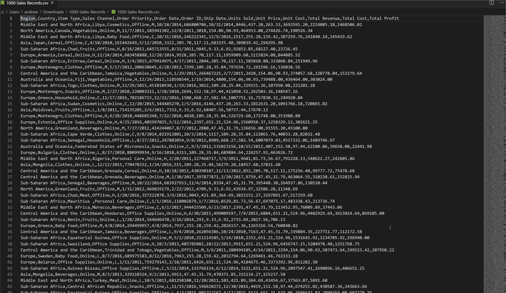

# CSV/TSV/PSV to Table

Convert your CSV/TSV/PSV files to an ASCII formatted table.

Useful when you want to paste CSV related data into an e-mail or Slack room.

By default the generated table opens in a new editor tab, but you can change this to update the existing editor via extension settings.

## Quick Start

Select the rows of CSV text (or no selection, to convert the entire document) and then via the command palette choose __Convert to table from CSV/TSV/PSV__ to have the text replaced with an ASCII formatted table.

## Features

CSV to Table in action on an example data set.

## Release Notes

See Changelog for details of release notes.

## Attributions
Icon made by Pixel Perfect (https://www.flaticon.com/authors/pixel-perfect) from www.flaticon.com
